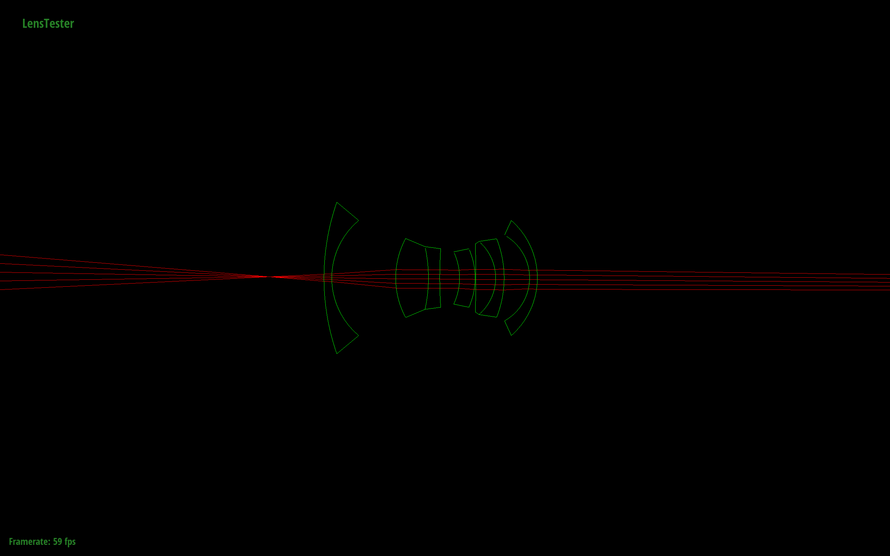

        
 For this project, I augmented my ray tracing program to simulate lenses! In the original raytracer, I was simulating a pinhole camera, or "camera obscura". I was tracing light rays through an aperture the size of one point to generate an image. Most cameras we use today are more sophisticated: they include lenses which bend the light rays and varying aperture sizes. By simulating different lenses and apertures, I can achieve a variety of effects with my raytracer. 

    <h2 align="middle">Part 1: Tracing Rays Through Lenses </h2>
        

        

 A pinhole camera is one with a point sized aperture. 

> **Aperture:**   
The space or hole light passes through in a camera. 

 The pinhole camera generates images just fine, but it is limited in terms of the focus and zoom effects we can generate. Photographers choose the appropriate lens for their shot. There are wide angle lenses which can capture a large landscape with the entire scene in focus, lenses built to focus on an object in the foreground and blur the background, fisheye lenses, and more. By simulating lenses, the ray tracer can generate images with varying perspectives and focal effects, much like a photographer can by changing his lens. 

 I simulated four different lenses: a D-GAUSS F/2 22deg HFOV, Wide-angle (38º) Nakamura, SIGLER Super Achromate Telephoto, and Muller 16mm/f4 155.9FOV Fisheye lens.

 
            
            <figcaption align="middle">D-GAUSS F/2 22deg HFOV </figcaption>
            
            <figcaption align="middle">Wide-angle (38º) Nakamura  </figcaption>
            
            <figcaption align="middle">SIGLER Super Achromate Telephoto</figcaption> 
              
            
            <figcaption align="middle">Muller 16mm/f4 155.9FOV Fisheye  </figcaption>

    
|Lens:                           | D-GAUSS F/2 22deg HFOV    | Wide-angle (38º) Nakamura        | SIGLER Super Achromate Telephoto| Muller 16mm/f4 155.9FOV Fisheye | 
|---------------------------------|:-------------------------:|:--------------------------------:|:-------------------------------:|:-------------------------------:|
|                                 |                           |                                  |                                 |                                 |
| **Focal Length**                   |  50.3582                  |                           22.0235|                        249.567  |                          9.99142|
|                                 |                           |                                  |                                 |                                 |
| **Infinity Focus Sensor Depth**     |  51.2609                  |                           28.7635|                          188.758|                          28.7443|
|                                 |                           |                                  |                                 |                                 |
| **Close Focus Sensor Depth**        |  62.7567                  |                           34.5797|                          236.875|                          31.1818|
|                                 |                           |                                  |                                 |                                 |
| **Close Focus Distance**           |  -264.605              |  -109.048                         |    -1646.2                        |  -60.8527                    |

<h3 align="left"> Sensor Depth vs. Conjugate Plots</h3>

 
            <figcaption align="middle">D-GAUSS F/2 22deg HFOV </figcaption>
            
             
            <figcaption align="middle">Wide-angle (38º) Nakamura  </figcaption>
            
             
            <figcaption align="middle">SIGLER Super Achromate Telephoto</figcaption>
            
             
            <figcaption align="middle">Muller 16mm/f4 155.9FOV Fisheye  </figcaption>
            
              

<h3 align="left">Pinhole vs Lens Renders</h3>

 
            
            <figcaption align="middle">Pinhole Camera Bunny </figcaption>
            
            <figcaption align="middle">Bunny Rendered with D-GAUSS F/2 22deg HFOV </figcaption>  
            <figcaption align="left">Notice the red wall in the foreground is blurred, aswell as the blue wall in the background. It looks a lot nicer, doesn't it?</figcaption>        

<h2 align="middle">Part 2: Contrast Based Autofocus</h2>

 I think this was the coolest part of the project, and it was relatively simple! I implemented autofocus, so that after I render an image, I can select a small patch I want to focus on, and the program will render the image focusing in that area. Kind of like when you take a picture on your iphone, you can tap the area of the viewer that you want to focus on. 
 
 <h3 align="middle">Focus Metric and Heuristic</h3>

So, the important question is: how am I going to measure how focused an image is? To be able to autofocus, I need some kind of metric that can distinguish a better-focused image from a worse one. 

 The answer to this is to measure the variance of the colors in the image. A really blurry image will have low variance, since all of the colors are blurred. As it gets blurrier, the colors kind of blend together, and they vary less. A sharp, focused image on the other hand will have high variance.

 I calculated the variance of each color in the image: red, blue, and green. First I found the mean red, blue, and green values in the image. Then, I summed the difference between each sample and the mean for that color squared. Finally I normalized this value over the number of samples to find the variance. 

sum(sample_i - mean^2)/num_samples

 By adding the red, blue and green variance, I created a heuristic to measure how focused the image was. Then, I just chose the sensor depth that corresponded with the highest value of the heuristic 

            
            <figcaption align="left"> A plot of the focus metric vs. sensor depth for a render of Cornelle Box Spheres.   In this case, you can see the image is becoming more focused as it approaches a sensor depth of ~60. Once the sensor depth increases past 60, the focus metric (a function of variance) starts decreasing. 60 is the ideal sensor depth for this render to be focused.</figcaption>

             
            

<h3 align="left"> Final Renders</h3>

 
            <figcaption align="middle">D-GAUSS F/2 22deg HFOV </figcaption>
            
             
            <figcaption align="middle">Wide-angle (38º) Nakamura  </figcaption>
            
             
            <figcaption align="middle">SIGLER Super Achromate Telephoto</figcaption>
            
             
            <figcaption align="middle">Muller 16mm/f4 155.9FOV Fisheye  </figcaption>
            
              

